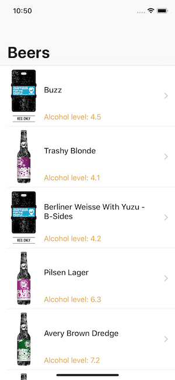
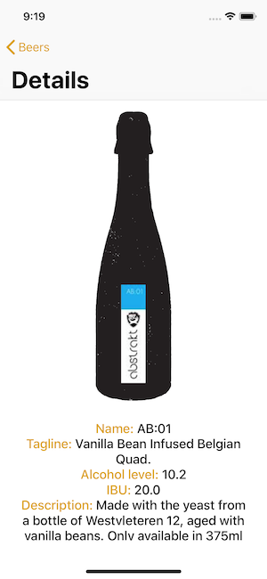

# iOS Beer

**Info**  
Programming languange: `Swift 4.1`  
Tool: `Xcode 9.3.1`  
Dependency manager: `cocoapods`

**Proposal**  
Show a list of beer 🍺 using the Punk API.

**Dependencies**  
- Swiftlint  
- Alamofire  
- AlamofireImage

**Images**  

